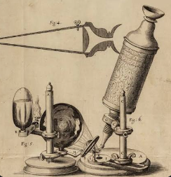
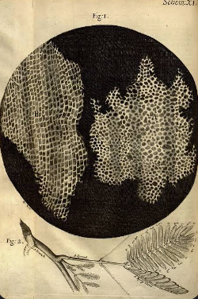
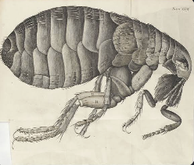
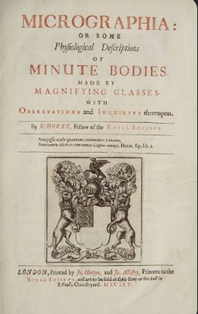

# 🔬 Misión 1 — "Primera luz" (30 minutos, hoy mismo)
*Del Cuaderno del Joven Microscopista · Misión 1 de 8*

## Por qué esta misión importa

En 1665, un inglés curioso llamado **Robert Hooke** puso un trozo de corcho bajo su microscopio y vio algo que nadie había visto jamás: miles de cajitas minúsculas, ordenadas como las celdas de un panal. Las llamó ***cells*** — células. No sabía lo que acababa de descubrir: la unidad básica de toda la vida. Publicó sus dibujos en el libro *Micrographia*, y uno de ellos —una pulga gigante dibujada con todo detalle— dejó boquiabiertos a los londinenses.

|  |  |
|---|---|
| *El microscopio de Hooke* | *El corcho: las "cells"* |

|  |  |
|---|---|
| *La pulga gigante* | *Portada de Micrographia (1665)* |

Tu misión de hoy es más modesta que la de Hooke, pero es exactamente la misma hazaña: **conseguir tu primera imagen nítida con tus propias manos**. Todo microscopista recuerda su "primera luz". Esta es la tuya.

## Qué vas a aprender

- Montar una muestra en la platina y sujetarla con las pinzas.
- Enfocar con el tornillo grande (macrométrico) y afinar con el pequeño (micrométrico).
- Mover la muestra con la platina mecánica… y descubrir que la imagen se mueve al revés.
- Pasar de 40X a 100X y a 400X sin perder la muestra.
- Hacer tu primera foto con el ocular electrónico.

## Material

- Tu microscopio (oculares WF10x puestos; revólver en el objetivo 4X).
- Una letra "e" impresa en papel fino (recorta un trocito de periódico o imprime una "e" grande) **o** unos granos de sal gruesa o azúcar.
- Un portaobjetos (el cristal rectangular). Hoy no hace falta cubreobjetos.
- El ocular electrónico conectado al ordenador (lo usarás al final).

## Protocolo paso a paso

> Regla de oro: empieza SIEMPRE con el objetivo más pequeño (4X). No toques las lentes con los dedos.

1. **Prepara la mesa.** Microscopio sobre una superficie estable, luz encendida a media intensidad, diafragma del condensador a la mitad. Revólver en 4X, oculares WF10x.
2. **Monta la muestra.** Pon la letra "e" (o los granos) en el centro del portaobjetos y colócalo en la platina, sujeto con las pinzas. La muestra debe quedar justo sobre el agujero por donde sube la luz.
3. **Aproxima con cuidado.** Mirando el microscopio *desde fuera* (no por el ocular), sube la platina con el tornillo macrométrico hasta que el objetivo 4X quede a ~1 cm de la muestra. Así evitas chocarlos.
4. **Enfoca.** Mira por los oculares y gira el macrométrico *despacio hacia abajo* hasta que la "e" aparezca nítida. Ajusta la distancia entre oculares si ves doble.
5. **Pasea por la muestra.** Gira las ruedecitas de la platina mecánica. Observa dos cosas: la muestra se desplaza milímetro a milímetro… **¡y la imagen se mueve al revés de tu mano!** Prueba a llevar la "e" al centro del campo. Acostúmbrate: esto es lo más raro del primer día.
6. **Sube a 100X.** Gira el revólver al objetivo 10X (clic). La imagen se habrá desenfocado un poco: reenfoca **solo con el micrométrico** (el pequeño). Quizá tengas que subir un poco la luz.
7. **Sube a 400X.** Gira al objetivo 40X. Reenfoca solo con el micrométrico, con paciencia: el campo ahora es diminuto y cualquier movimiento se nota mucho. Si pierdes la muestra, vuelve a 4X y repite.
8. **Tu primera foto.** Sin mover nada, cambia al ocular electrónico del tercer tubo y mira la pantalla del ordenador. Ajusta luz y contraste en el programa y guarda la foto como `2026-09-06_primeraluz_400x.jpg`.

## Esquema: qué estás viendo

```
┌──────────────────────────────┐
│  Oculares WF10x (tus ojos)   │
│  Revólver → objetivo 4X/10X/40X
│  Platina: portaobjetos + "e" │
│  Condensador + luz (abajo)   │
└──────────────────────────────┘
Aumento total = ocular × objetivo → 10×4 = 40X · 10×10 = 100X · 10×40 = 400X
La "e" aparece INVERTIDA (del revés): es normal, las lentes le dan la vuelta.
```

## Preguntas para tu cuaderno

- ¿Por qué la imagen se mueve al revés cuando mueves la platina?
- ¿Por qué hay que reenfocar al cambiar de objetivo? ¿Por qué solo con el micrométrico en aumentos altos?
- La "e" se ve del revés: ¿qué le hacen las lentes a la luz para que pase eso?

## Ficha de laboratorio

📋 **[Descarga tu hoja de resultados (PDF para imprimir)](ficha-mision1.pdf)** — anota fecha, aumentos, dibujo de lo que ves y tu pregunta nueva.

## Reto superado cuando…

✅ Pasas de 40X a 400X sin perder la muestra, sabes explicar por qué la imagen va al revés, y tienes tu primera foto guardada.

## 🔦 Reto final (optativo): la entrada ganadora de la feria

*Un caso para resolver solo con lo que aprendiste hoy: enfocar, moverte con la imagen invertida y no perder la muestra al subir de aumento.*

**La historia.** En la tómbola de la feria del barrio ha pasado algo gordo 🎡: dos niños reclaman el mismo premio con entradas que *a simple vista son idénticas*. El feriante, Don Trini, está desesperado: una es la ganadora… y la otra una fotocopia. Pero tiene un as en la manga: *"La entrada de verdad lleva un secreto que solo se ve con microscopio"* —unas **microletras** impresas en una esquina (`★ FERIA 2026 ★`), demasiado pequeñas para el ojo y que ninguna fotocopia reproduce. Te ha llamado a ti, joven microscopista, como perito.

**Tu misión.** El feriante (un adulto) pega un trocito de cada entrada (A y B, sin decirte cuál es cuál) en dos portas. Tú debes navegar cada muestra hasta encontrar la esquina del secreto, enfocarla a 400X y leerla:

| Lo que ves a 400X | Veredicto |
|---|---|
| Microletras nítidas `★ FERIA 2026 ★` | ✅ Entrada **auténtica**: esa es la ganadora. |
| Nada, o manchitas borrosas sin letras | ❌ **Fotocopia**: alguien intentó engañar a Don Trini. |

**Cómo hacerlo.**

1. Empieza en 40X y "pasea" con la platina hasta la esquina marcada. Recuerda: **la imagen va al revés** —si quieres ir a la derecha, mueve hacia la izquierda.
2. Centra el puntito sospechoso y sube a 100X y luego a 400X, reenfocando **solo con el micrométrico**. Si la pierdes, vuelve a 4X y repite (eso también es de peritos).
3. Fotografía la prueba con el ocular electrónico y dicta tu veredicto por escrito: *"La entrada ganadora es la…"*.

<details>
<summary>🔒 Solución — solo para padres y madres (pulsa para abrir)</summary>

**El truco científico:** el microtexto es una medida anti-falsificación de verdad: billetes, pasaportes y muchas entradas lo llevan, porque las impresoras y fotocopias normales no resuelven letras tan pequeñas (se vuelven borrones). Con 400X se lee sin problema.

**Veredicto modelo:** el adulto decide de antemano cuál es la "auténtica" (puede escribir el microtexto a mano con rotulador finísimo o imprimirlo muy pequeño). La gracia está en la **navegación invertida**: moverse por la muestra sin perderse es LA habilidad de esta misión, y el caso la pone a prueba de forma natural.

**Matiz para comentar con el joven perito:** los peritos forenses hacen exactamente esto con billetes sospechosos, comparando microletras y fibras del papel. Y el movimiento invertido no es un capricho: telescopios, endoscopios y cámaras de cirugía también muestran la imagen girada, y sus operadores entrenan lo mismo que tú hoy.
</details>

---
*← [Cuaderno del Joven Microscopista](../README.md) · Siguiente: [Misión 2 — El mundo invisible del agua](../mision-2-agua/README.md)*