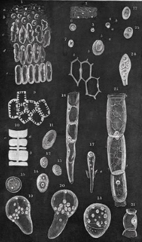
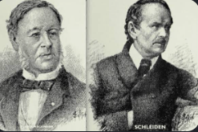

# 🧅 Misión 3 — Células vegetales (la cebolla)
*Del Cuaderno del Joven Microscopista · Misión 3 de 8*

## Por qué esta misión importa

Cuando **Robert Hooke** miró corcho en 1665 vio solo las *paredes* de células muertas —como mirar una casa vacía. Pero la pregunta quedó abierta: ¿cómo es una célula **viva** por dentro? Durante 150 años los microscopistas fueron mejorando lentes y tinciones hasta que en 1838–1839 **Schleiden y Schwann** propusieron la gran idea: ***todos* los seres vivos estamos hechos de células** —plantas, animales, tú. Es la teoría celular, uno de los pilares de la biología.

|  |  |
|---|---|
| *Células vegetales dibujadas por Schleiden* | *Schleiden y Schwann: la teoría celular (1838–1839)* |

La piel de cebolla es la puerta de entrada perfecta: sus células son grandes, transparentes y forman un mosaico de "ladrillos" que se ve con un microscopio escolar. Y con una gota de colorante, aparece el secreto: el **núcleo**.

## Qué vas a aprender

- Hacer una preparación de **tejido fresco**: pelar la epidermis fina de la cebolla.
- Observar **pared celular** (el "ladrillo") y, con tinción, el **núcleo**.
- Entender por qué las células vegetales tienen forma fija y las animales no.
- Trabajar en 100X–400X con muestras casi transparentes (¡juega con el diafragma!).

## Material

- Microscopio (WF10x, empezar en 4X).
- Una cebolla (cualquier tipo), cuchillo (pide ayuda a un adulto para cortar un gajo).
- Pinzas finas (de depilar valen), portaobjetos, cubreobjetos, gotero.
- Agua limpia.
- **Colorante (elige uno):** azul de metileno (ideal, se pide en farmacia), lugol, o tinta azul de bolígrafo muy diluida en agua (último recurso).
- Papel absorbente.

## Protocolo paso a paso

1. **Consigue la piel.** Corta un gajo de cebolla. Por su cara interior (la cóncava) hay una telilla transparente: pellízcala con las pinzas y tira despacio para arrancar un trocito de ~5×5 mm. Cuanto más fino y sin arrugas, mejor.
2. **Móntala en agua.** Pon una gota de agua en el portaobjetos, extiende la telilla encima con las pinzas (que quede plana, sin doblarse) y baja el cubreobjetos en ángulo. Seca el exceso.
3. **Observa SIN teñir (100X).** WF10x + objetivo 10X, luz media-baja, diafragma más bien cerrado. Verás el mosaico de células alargadas como ladrillos. Busca: la **pared** (línea que delimita cada célula) y, quizá, una zona más densa dentro (el citoplasma).
4. **Tiñe.** Sin desmontar nada: pon una gota de colorante en un borde del cubreobjetos y, por el borde opuesto, absorbe con un papel. El colorante cruzará por capilaridad bajo el cubre y teñirá las células. Espera 1–2 minutos.
5. **Observa TEÑIDO (100X → 400X).** Ahora cada célula muestra un punto oscuro: el **núcleo**. Centra una célula bonita y sube a 40X (400X total), reenfocando solo con el micrométrico. Fotografía con el ocular electrónico: `2026-09-0X_cebolla_400x.jpg`.
6. **Compara.** Mira una zona teñida y una sin teñir (a veces el colorante no llega a todo). ¿Qué revela la tinción que antes era invisible?

## Esquema: tu célula de cebolla

```
┌─────────┬─────────┬─────────┐
│         │         │         │   ← pared celular (el "ladrillo")
│   ····(●)····    │         │   ← (●) núcleo (se ve con tinción)
│         │         │         │
├─────────┼─────────┼─────────┤
Pared = caja rígida de celulosa. Núcleo = "cerebro" con las instrucciones.
Las vegetales tienen pared + forma fija. Tus células (Misión 4) no la tienen.
```

## Preguntas para tu cuaderno

- ¿Por qué la cebolla forma "ladrillos" regulares y tu mejilla (Misión 4) no?
- El colorante tiñe más el núcleo que el resto: ¿qué crees que significa eso sobre de qué está hecho el núcleo?
- Hooke vio células muertas (corcho). Las tuyas ¿están vivas? ¿Cómo lo sabrías?

## Ficha de laboratorio

📋 **[Descarga tu hoja de resultados (PDF para imprimir)](ficha-mision3.pdf)** — dibujo de célula sin teñir vs. teñida, etiquetas (pared/núcleo) y comparación.

## Reto superado cuando…

✅ Ves el mosaico de células, tiñes con éxito, fotografías al menos un núcleo nítido a 400X y etiquetas tu dibujo.

## 🥗 Reto final (optativo): el plástico de la ensalada

*Un caso para resolver con tu técnica de tinción: ¿célula vegetal o trozo de plástico?*

**La historia.** Chicote está en el restaurante *"La Lechuga Alegre"* hay un buen lío 🍽️: un cliente jura que encontró un **trozo de plástico transparente** en su ensalada y exige que cierren la cocina. La cocinera, Doña Remedios, lo niega con el gorro en la mano: *"¡Eso no es plástico, es una telilla de cebolla que se me escapó al cortar!"*. El inspector de sanidad no sabe a quién creer… y te ha llamado a ti, joven microscopista, como perito. El fragmento misterioso ya está guardado en un porta (que prepara un adulto: no toques comida desconocida con las manos y lávatelas al terminar).

**Tu misión.** Monta el fragmento en agua, obsérvalo y tíñelo como hiciste con la cebolla. Después, dicta tu veredicto:

| Lo que ves | Veredicto |
|---|---|
| Mosaico de "ladrillos" regulares y, con tinción, un **núcleo** oscuro en cada uno | ✅ Es **piel de cebolla**. Doña Remedios **dice la verdad**: fue un descuido, no plástico. |
| Lámina amorfa o con estrías de fábrica, **sin células ni núcleos** por más que tiñas | ❌ Es **plástico**. El cliente **tiene razón**: hay que revisar la cocina. |

**Cómo hacerlo.**

1. Observa SIN teñir a 100X con el diafragma algo cerrado. ¿Ves ladrillos… o una lámina sin dibujo?
2. Tiñe por capilaridad, espera 1–2 minutos y busca núcleos a 100X–400X.
3. Compara con tu preparación de cebolla de hoy (tu "patrón de referencia") y escribe tu informe: *"Yo, perito microscopista, declaro que el fragmento es…"*.

<details>
<summary>🔒 Solución — solo para padres y madres (pulsa para abrir)</summary>

**El truco científico:** la pared de celulosa mantiene la forma de "ladrillo" incluso en un fragmento suelto, y el colorante revela el núcleo: dos firmas que el plástico jamás tiene. El plástico es una lámina continua, a veces con estrías de fabricación, pero sin compartimentos ni nada que se tiña como un núcleo.

**Veredicto modelo:** el adulto decide la prueba: un trozo real de epidermis de cebolla (culpa a la cocinera de un descuido, inocente del delito) o un trocito de bolsa transparente (culpa a la cocina). Lo ideal: hacerlo dos veces, una con cada uno, sin decirle al perito cuál es cuál.

**Matiz para comentar con el joven perito:** el control de calidad de los alimentos usa microscopía de verdad para esto mismo… y al revés: para cazar **microplásticos** en agua y comida, donde la pregunta es la contraria (¿esto que parece resto vegetal es en realidad plástico?). El microscopio no ve "verdad o mentira": ve estructura, y la estructura delata el origen.
</details>

---
*← [Cuaderno del Joven Microscopista](../README.md) · Siguiente: [Misión 4 — Tus propias células](../mision-4-mejilla/README.md)*
